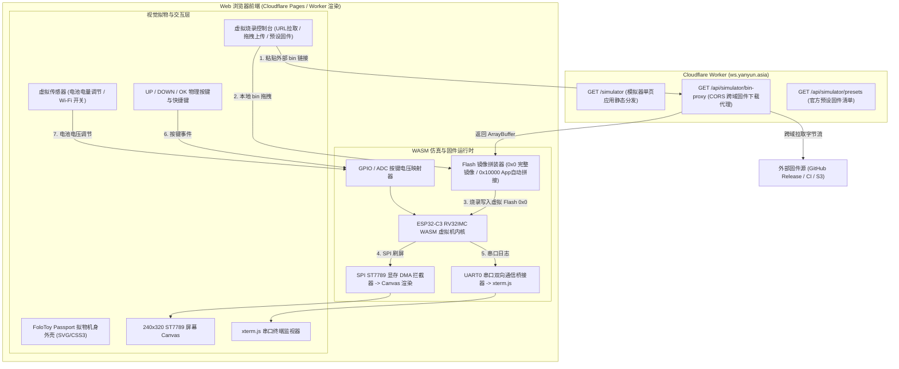

# FoloToy AI Passport Web 在线模拟器设计与技术方案

## 1. 目标与背景

为了降低用户、开发者和开源社区体验 **FoloToy AI Passport (ESP32-C3)** 的门槛，无需物理硬件和串口线即可在浏览器端即时体验固件功能，本项目将在 Cloudflare 端新增 `/simulator` 页面，提供一套高拟真度的 **Web 在线模拟器与虚拟烧录系统**。

### 核心功能需求
1. **真机外观与拟物化交互**：在 Web 上 1:1 还原 AI Passport 硬件外观、240x320 ST7789 LCD 屏幕、3 个物理功能按键（UP / DOWN / OK）、电源指示灯与状态。
2. **多模式固件加载与在线烧录**：
   - **预设固件一键体验**：官方最新 Release / 各 Demo 独立固件免配置即点即玩。
   - **URL 外部固件加载**：支持用户输入任意外部 `.bin` 固件链接（如 GitHub Release、CI 构建产物），自动通过 Cloudflare CORS 代理流式加载。
   - **本地固件拖拽上传**：支持本地 `.bin` 文件拖入。
   - **拟真烧录流程体验**：模拟 `esptool.py` 烧录交互（Sync Bootloader -> Chip Erase -> Flash 0x0/0x10000 写入 -> 校验 -> 重启）。
3. **机器码真机仿真 (RISC-V WASM)**：浏览器内直接执行真实的 ESP32-C3 RV32IMC 机器码固件，驱动 SPI ST7789 屏幕渲染到 Canvas。
4. **实时串口监视器 (Serial Monitor)**：基于 `xterm.js`，实时输出 ESP32-C3 ROM 启动日志、2nd Stage Bootloader、FreeRTOS 调度器与固件 `ESP_LOG` 输出。
5. **虚拟外设与传感器控制**：支持动态模拟电池电压（ADC 调节）、按键连发与长按、Wi-Fi 状态开关、一键截屏保存等。

---

## 2. 总体架构设计

系统分为 **浏览器前端运行沙箱（Web Sandbox）** 与 **Cloudflare 后端支持层（Worker Relay/Proxy）**：



---

## 3. 详细技术方案与模块设计

### 3.1 视觉拟物化与 UI 设计
- **机身造型**：
  - 1:1 还原 FoloToy AI Passport 尺寸比例（钛灰深色磨砂质感、圆角、精致高光倒角）。
  - 屏幕区域：240x320 像素 IPS 全彩屏幕，支持微弱的 LCD 背光发光与防锯齿像素网格特效。
  - 按键布局：顶部/侧边 UP（按键1）、DOWN（按键2）、OK（按键3，长按返回）。
- **右侧工作台（Tab 布局）**：
  - **Tab 1: 固件与烧录 (Firmware Flash)**
    - 预设官方 Demo 选择（Default AI Passport, LVGL Demo, Game, Audio Test）。
    - 外部 `.bin` 下载链接输入框 +「一键拉取烧录」按钮。
    - 本地文件拖拽区（支持 `.bin` / `.zip`）。
    - 拟真烧录进度条、波特率选择、Flash 偏移配置（默认 `0x0` 或 `0x10000`）。
  - **Tab 2: 串口日志 (Serial Monitor)**
    - `xterm.js` 黑色控制台，支持 ANSI 彩色高亮（ESP-IDF 日志颜色原生还原：绿、红、黄、青）。
    - 自动滚屏、一键复制、日志清空、日志导出下载。
  - **Tab 3: 虚拟硬件调测 (Hardware Control)**
    - 电池电压滑动条：`3.0V ~ 4.2V`（对应电量 `0% ~ 100%`），触发模拟器 ADC 读数更新。
    - 屏幕截图：一键导出当前屏幕为 PNG 图片。
    - 模拟运行统计：CPU 模拟频率、当前帧率 (FPS)、SRAM 占用率。

### 3.2 固件二进制处理与 Flash 镜像管理

ESP32-C3 的启动依赖 Flash 镜像的分区结构：
```text
0x0000_0000: Bootloader (引导程序，约 12~16 KB)
0x0000_8000: Partition Table (分区表，约 3 KB)
0x0000_9000: NVS 分区 (初值全 0xFF)
0x0000_F000: OTA Data
0x0001_0000: 应用程序主固件 (app.bin，如 ai-passport.bin)
```

**模拟器的固件适配器（Flash Builder）支持两种格式：**
1. **完整固件 (`merged-firmware.bin`，推荐)**：
   - 包含从 `0x0` 开始的完整 4MB 镜像，模拟器直接将其写入虚拟 Flash 的 `0x0` 地址启动。
2. **单一 App 固件 (`ai-passport.bin`)**：
   - 用户仅上传了 `ai-passport.bin` 时，模拟器前端自动合并预置的通用 `bootloader.bin` (0x0) 和 `partition-table.bin` (0x8000)，将用户 bin 拼装在 `0x10000`，自动生成可执行镜像。

### 3.3 ESP32-C3 RISC-V 虚拟机与外设仿真

1. **CPU 仿真内核**：
   - 采用 WebAssembly 编译的 32-bit RISC-V (RV32IMC) 解释器。
   - 具备完整内存总线模型（`0x40000000` I-RAM, `0x3FC80000` D-RAM, `0x42000000` Flash Cache）。
2. **ST7789 SPI LCD 仿真器**：
   - 挂载在虚拟 SPI2 控制器。
   - 监听命令 `0x2A` (CASET: 列地址)、`0x2B` (RASET: 行地址)、`0x2C` (RAMWR: 写显存)。
   - DMA 批量传输时，通过 TypedArray 直接将 RGB565 (16bit) 批量转换为 RGBA32 (32bit) 写入 `<canvas>` 的 `ImageData`，由 `requestAnimationFrame` 驱动 60FPS 渲染。
3. **GPIO / 按键仿真**：
   - UP 键：映射对应 GPIO 状态切换。
   - OK / DOWN 键：映射对应按键引脚及 ADC 分压采样值。
   - 支持键盘映射：`KeyW` / `ArrowUp` -> UP，`KeyS` / `ArrowDown` -> DOWN，`Enter` / `Space` -> OK。
4. **UART0 仿真**：
   - 监听 UART0 TX FIFO 寄存器写入，将输出字节流发送给前端 `xterm.js`。

### 3.4 Cloudflare Worker 端服务支撑

在 [`cloudflare/src/index.ts`](file:///Users/tsai/AI-Proj/ai-passport/cloudflare/src/index.ts) 中增加以下 API 与页面路由：

1. **`GET /simulator`**：
   - 返回轻量、高性能、单文件打包内嵌的 Web 模拟器应用 HTML/CSS/JS 页面。
2. **`GET /api/simulator/bin-proxy?url=<target_bin_url>`**：
   - **跨域代理**：从 GitHub Releases 或第三方 CDN 拉取固件二进制流。
   - **安全校验**：限制仅允许 `http/https` 协议、最大固件大小限制 16MB、响应包含 `Content-Type: application/octet-stream` 和 `Access-Control-Allow-Origin: *`。
3. **`GET /api/simulator/presets`**：
   - 返回官方默认可供快速体验的固件列表（名称、描述、版本、bin 文件的直链下载地址）。

---

## 4. 实施阶段规划

| 阶段 | 任务目标 | 产出物 |
| :--- | :--- | :--- |
| **Phase 1** | 设计与架构定稿 | 形成完整的技术设计文档与接口规范 |
| **Phase 2** | Cloudflare Worker 路由与 API | 在 `index.ts` 增加 `/simulator` 页面路由及 `/api/simulator/bin-proxy` 跨域代理 |
| **Phase 3** | 前端拟物化 UI 与工作台开发 | Passport 拟真机身外壳、240x320 Canvas 屏幕、xterm.js 串口终端、烧录控制台、按键映射 |
| **Phase 4** | WASM 模拟核心与 Flash 烧录器集成 | 集成 RISC-V 运行引擎、ST7789 SPI Canvas 渲染器、自动 Flash 拼装烧录逻辑 |
| **Phase 5** | 验证与测试 | 冒烟验证官方固件加载、外部 URL 拉取、本地拖拽烧录、按键与屏幕显示 |
